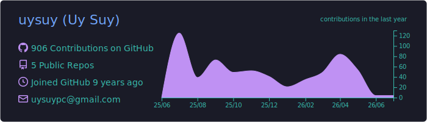
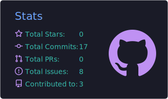
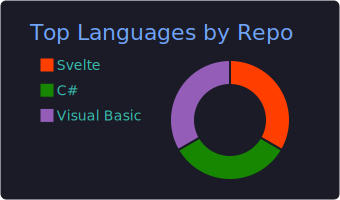
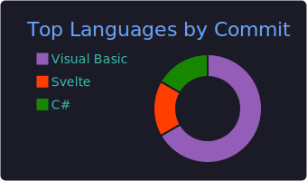
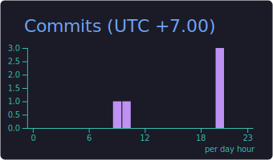

## 🚀 About Me

- 🏦 Backend Engineer working in **Banking & Fintech** (Payment Processing Systems)
- 💳 Specialized in **ISO 20022** messaging — `pain.001`, `pacs.008`, `camt.053/054`, SWIFT SR2026
- 🏗️ Building **modular monoliths** in Go with clean layered architecture (Handler → Service → Repository)
- 📊 Experienced with **regulatory reporting** (NBC R115/R004) and ERP integrations
- 🌱 Currently exploring **FastAPI** and cross-language architecture patterns
- 📍 Based in Phnom Penh, Cambodia 🇰🇭

 

## 🛠️ Tech Stack

### Languages & Frameworks

  

### Databases & Messaging

  

### DevOps & Tools

  

### Domain Expertise

  
  
  
  

 

## 📊 GitHub Stats

  

  
  

  
  

  

 

## 📫 Connect With Me

  
  
  

 

  

  ⚡ "Building reliable payment rails, one message at a time"

